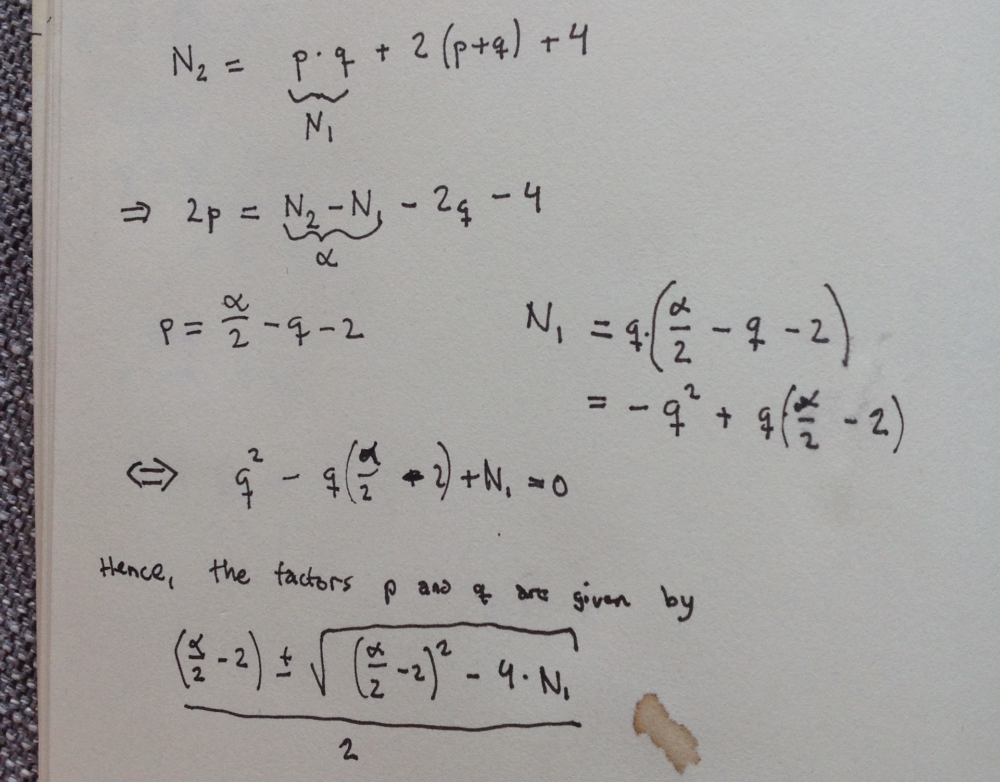

# Palindrome (30 p)

We are to generate a palindrome from a series of words. One idea is to generate all permutations and check if it is a palindrome. However, a more careful and efficient technique is as follows. Pick a pair of words A and B. Check if the words A and B matches up to a length of the shortest word. If so, append them to a string. Remove them from the set and recursively pick new words. If we reach a point where we do not find any solution, we simply backtrack. We can do this in (pretty ugly) Python code:


```python
import socket, copy

def palindrome(words, left, right, sl, sr):
    if len(words) > 1:
        for i in range(0,len(words)):
            for j in range(0,len(words)):
                l = words[i]
                r = words[j]
                if i != j:
                    right_p = r + right
                    left_p = left + l
                    sl_p = sl + ' ' + l
                    sr_p = r + ' ' + sr
                    p = min(len(right_p), len(left_p))
                    if left_p[:p] == right_p[::-1][:p]:
                        M = copy.copy(words)
                        M.remove(l)
                        M.remove(r)
                        y = palindrome(M, left_p, right_p, sl_p, sr_p)
                        if y != False:
                            return y
    elif len(words) == 1:
        y = left + words[0] + right
        if y == y[::-1]:
            return sl + ' ' + words[0] + ' ' + sr
        else:
            return False
    else:
        y = (left + right)
        if y == y[::-1]:
            return (sl + ' ' + sr)
        else:
            return False
    return False
            

s = socket.create_connection(('ppc1.chal.ctf.westerns.tokyo', 31111))
print s.recv(1024)
data = s.recv(1024)

while True:
    for line in data.split('\n'):
        ll = line.split(' ')
        if ll[0] == 'Input:':
            uu = palindrome(ll[2:],'','','','')
            s.send(uu + '\n')
    data = s.recv(1024)
    print data
    if data == '': # no more data, quit
        break
```

This gives us two flags

```
TWCTF{Charisma_School_Captain}
```

and

```
TWCTF{Hiyokko_Tsuppari}
```
# Twin primes (50 p)

```
Decrypt it. 
```

The code can be found here [code](twin-primes/encrypt.py). 

We are given a cipher which encrypts under two different keys. The moduli are N₁ = p × q and N₂ = (p + 2) × (q + 2). This is a problem... do you see why?



Or as Python code

```python
with open("key1", "r") as f:
    n1 = int(f.readline())
with open("key2", "r") as f:
    n2 = int(f.readline())
with open("encrypted", "r") as f:
    c = int(f.readline())

alpha = (n2 - n1)

p1 = ((alpha/2-2) + libnum.common.nroot((alpha/2-2)**2 - 4*( n1), 2))/2
q1 = ((alpha/2-2) - libnum.common.nroot((alpha/2-2)**2 - 4*( n1), 2))/2
p2 = p1 + 2
q2 = q1 + 2

d1 = inverse(65537, (p1-1)*(q1-1))
d2 = inverse(65537, (p1+1)*(q1+1))

c = pow(c, d2, p2*q2)
c = pow(c, d1, p1*q1)

print [long_to_bytes(c)]
```

The code prints

```
TWCTF{3102628d7059fa267365f8c37a0e56cf7e0797ef}
```

This is also the reason why φ(N) should be kept secret.

# Super Express (100 p)

Challenge [code](super_express/problem.py).

This is an affine cipher in disguise. Unravelling the encryption, we find that its closed form is (a₀ × a₁ × ...) × cᵢ + β, where β is a constant depending only on the secret key. Since a₀ × a₁ × ... also is constant, we can rewrite the equation as f(cᵢ) = α × cᵢ + β. Note that all operations are taken modulo 251. We first determine α, by computing y = f(cᵢ) - f(cⱼ) = α × (cᵢ - cⱼ). Then, α = y × (cᵢ - cⱼ)⁻¹. Then, we can determine β as f(cᵢ) - α × cᵢ. And we are done.

```python
import libnum

key =  '****CENSORED****************'
flag = 'TWCTF{*******CENSORED********}'

f = open('encrypted', 'r')
data = f.read().strip('\n')

encrypted = [int(data[i:i+2],16) for i in range(0, len(data), 2)]

delta = ord(flag[0]) - ord(flag[1])
alpha_delta = encrypted[0] - encrypted[1]
alpha = (libnum.modular.invmod(delta, 251) * alpha_delta) % 251
beta = (251 + encrypted[0] - alpha * ord(flag[0])) % 251
alpha_inv = libnum.modular.invmod(alpha, 251)

print ''.join(chr(((enc - beta) * alpha_inv) % 251) for enc in encrypted)
```

which prints

```
TWCTF{Faster_Than_Shinkansen!}
```


# Pinhole Attack (500 p)

This is only a partial solution, but I spent several hours on it (essentially all the time I spent for the CTF) so I figured I wanted to write it down. During the CTF, I developed a method which queries the oracle for ciphertexts c × (2ⁱ)ᵉ for i ∈ {0,1,2,...}. This causes the message to shift. Let N denote the modulus. If the message m has the property m × 2 < N, then it gets shifted properly. But if  m × 2 > N, then q = 2¹⁰²⁴ - N gets added to the message. We can detect this with a certain probability.

If we look at `(q >> 512) & 3`, it is equal to something like

```
        ...|10|100...
             ^
 these are the observed bits
```

*Case 1* : If we observe 0x10 from the oracle for Oracle(c), which corresponds to i = 0, and 0x01 for Oracle(c × 2ᵉ), for which i = 1, then clearly this is not valid shift. Only 0x01 and 0x00 would be valid. This corresonds below to that b does not remain constant.

```
query     observation
-----------------------
 q      ...|10|100...
 i      ...|ab|cde...   <--- we observed ab (previous)
 i+1   ...a|bc|de....   <--- we observed bc (received)

```
*Case 0* : We may also conclude that if b remains constant and the observed c = 1, then m × 2 < N. Here is why: for the bit in q to appear at the most significant observed position is added, then b would flip unless we had a carry from before. q is 0 in its least signficant observed position, so the only way to generate a carry to b is if c = 1 and we got a carry. But then the observed c would be 0. So this is a contradiction, proving our claim. 

The two implcations below hold with probability 1:

```
(received >> 1) != (previous & 1) implies m * 2 > N
(received >> 1) == (previous & 1) and received & 1 != 0 implies m * 2 < N
```

There are 

```
    Bbc
    ---
    000    (-) <-- do not know!
    001    (0)
    010    (1)
    011    (1)
    100    (1)
    101    (1)
    110    (-) <-- do not know!
    111    (0)
```

There are some other cases when we do not get any information directly. In the table above, we see that the unknown case occurs with probability 1/4.  The output below shows the result of the above rules. The '-' char denotes the case when we do not know. '1' at position i means m × 2ⁱ > N and '0' that m × 2ⁱ < N.

```
0-11101000001-11111010-----0-1--1-0-111010-100--0--01--01-1-----1--100-0--0---1--10-0-1--1-1-1-010--1-10-1011---11-10-1001
-01100--110-1001-1--1-1--1-111--011-1--0-10-0011--1--0110011010--001001---1101--1-11-10-10-0-1----11-1---1-10--1--1-1--010
--00-110-0--1--0-11-01-0-001-10--1-11---1-00--11---10--1-00-1-0101-10-0---1--00-----01--1--0-0-1--11101----011-11--10--11-
10111--0-1110-1-100-110-1-10101-10--10-01001-1-010-101--0-0--01011-11-0-1---0-1-100101-1-0101--1-----11101---1-111--00-111
---11010---0-1-0-1000110-01----01000110-101-1100--01-10-0-11--10-00101-0011110-1-100--1---111---010000-0101-110-01-0001110
--1--1-0-110011111-111-1000--0---10---1---1-101--1-11---1-1101-10110110000-1-1-1--010-1111101-0011-111101-1---001--0011---
1101-01010--11001-010-1-0-1-0--1-1--01-10---111--0111-110-101-1-11001-10000000----0-100-0--1-11000--10-----11--0-------011
-11-0001-0-100001-1--0--0--1-0000-1-10-1---11110-110-1----00-1100--10-1---1-1-111-001-10-0-1011-101-0---1-10110000--111010
----01--0---1-11---1-01010-0----100-10--11--11-1
```
Using this procedure, we can make something that is equivalent to an unreliable parity oracle:

```python
    
	s = socket.create_connection(('cry1.chal.ctf.westerns.tokyo', 23464))

    query = hex(ciphertext)[2:-1]
    s.send(query + '\n')
    c = ciphertext
    prev = oracle(c)
    prev = int(s.recv(1024).strip('\n'))

    str, i = '', 0

    UB_A = N
    LB_A = 0
    UB_B = N
    LB_B = 0

    while i < 1024:
        i += 1
        query = hex((ciphertext * pow(pow(2, i, N), e, N)) % N)[2:-1]
        s.send(query + '\n')
        received = int(s.recv(1024).strip('\n'))
        if (received >> 1) != (prev & 1): # certainly 2 * c > N
            LB_A = (UB_A + LB_A) / 2
            LB_B = (UB_B + LB_B) / 2
        else: # maybe 2 * c < N
            if received & 1 != 0: # certainly 2 * c < N
                UB_A = (UB_A + LB_A) / 2
                UB_B = (UB_B + LB_B) / 2
            else: # dont know, so systematically pick depending on upper or lower bound
                UB_A = (UB_A + LB_A) / 2
                LB_B = (UB_B + LB_B) / 2
        c = c * 2
        prev = received
```

The code above essentially performs a standard LSB-parity oracle approach, but generates an upper and lower bound. So for A, it will always pick m × 2ⁱ < N if it is uncertain and for B, we pick m × 2ⁱ > N. When it has converged, it will give bounds such that A ≤ m ≤ B. Now, these bounds are too large to search over. The idea is that we now multiply the ciphertext with c × (rⁱ)ᵉ, where r ranges over odd values i.e. r ∈ {1,3,5,...}. For each such call, we obtain different bounds. These bounds are saved in a dictionary D, as D[r] = (Aᵣ, Bᵣ).

Now, we pick all values (i, j) in D such that i | j. Then, we compute m = i / j and compute a new bound for i as Aᵢ = max[(Aⱼ + N × (m × Aᵢ / N)) / m, Aᵢ] and Bᵢ = min[(Bⱼ + N × (m × Bᵢ / N)) / m, Bᵢ]. This causes the bounds to shrink, because we essentially get the intersection of the two bounds [Aᵢ, Bᵢ] ∩ [Aⱼ, Bⱼ]. Using this procedure I could quickly derive that the message must lie between

```
32823687214648317854565996498127715773477719661588300036361344348268779067158124622809214303201900880376970461506509430208351576645452783336477745212665619037606884894955071171832617878450162718159837470351092692867634671360304227937938481806427078640094595673377568245932564341084208220118643785943406989323 
≤ 
m 
≤
32855216377024189727269669117124497589928498796460765070447488255773967798001885553443688015914515111173647783242749744418976678356582754164273728473740010022214396672335334385226728152455464872650057690654690151915043928956729822694563993145353643334565769076023314643154336007601125555041203806514918086265
```
(Unless I made a terrible mistake somewhere!) We can solve it by iterating the below code until it stops updating:

```python
    dd[i] = (A, B)
    for j in dd:
        for k in dd:
            if j % k == 0:
                m = k / j
                dd[j][0] = max((dd[k][0] + N * ((m*dd[j][0]) / N)) / m, dd[j][0])
                dd[j][1] = min((dd[k][1] + N * ((m*dd[j][1]) / N)) / m, dd[j][1])
    print dd[1][0]
    print dd[1][1]
```

I tried running the code on a local oracle with several known messages, and I could verify that the bounds indeed did converge correctly. However, gathering queries sufficiently many queries for the bounds to converge completely proved to be difficult, even with threading.